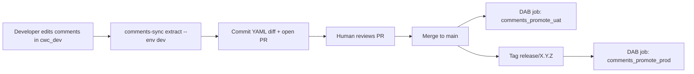

# Approach A — Azure DevOps PR review

> Comments live as YAML in this repo. An Azure DevOps PR is the approval.
> Promotion execution is handled by Databricks Asset Bundle (DAB) jobs.

## Why this approach

- **Strong audit trail** — git history is the approval log. Every comment
  change is reviewable as a normal code review.
- **DAB-native execution** — promotions run as Databricks jobs you can trigger
  from CI or manually.
- **Familiar to data platform teams** — same shape as schema migrations,
  IaC, etc.

## Trade-offs

- Requires comment authors to use git (clone, commit, PR).
- Two-stage promotion = two merges / one merge + one tag.

## Flow



## Setup

```bash
cd 01-azure-devops
pip install -e ".[dev]"
cp config.example.yaml config.yaml   # then edit
export DATABRICKS_HOST=https://fevm-serverless-stable-69ija6.cloud.databricks.com
export DATABRICKS_TOKEN=...

# Deploy DAB resources once per workspace/target
databricks bundle deploy
```

## Day-to-day developer loop

```bash
# Pull latest
git checkout main && git pull

# Branch
git checkout -b feature/document-orders-table

# Edit comments in Databricks (the cwc_dev catalog), then snapshot:
comments-sync extract --env dev

# Review the diff (this is what your reviewer will see in the PR)
git diff comments/

# Commit & open PR
git add comments/
git commit -m "Document orders table primary key and status enum"
git push -u origin feature/document-orders-table
az repos pr create --source-branch feature/document-orders-table --target-branch main
```

## Promote to UAT (DAB)

Merge the PR to `main`, then run:

```bash
# run from: 01-azure-devops/
databricks bundle run comments_promote_uat
```

Optional preview without applying:

```bash
# run from: 01-azure-devops/
databricks bundle run comments_diff_uat
```

## Promote to PROD (DAB)

After UAT bake-in, cut a tag:

```bash
git tag release/2026-05-28
git push origin release/2026-05-28
```

Then run:

```bash
# run from: 01-azure-devops/
databricks bundle run comments_promote_prod
```

Optional preview:

```bash
# run from: 01-azure-devops/
databricks bundle run comments_diff_prod
```

## DAB resources

`01-azure-devops/databricks.yml` defines four Databricks jobs:

- `comments_diff_uat` — preview DEV/YAML vs UAT
- `comments_promote_uat` — apply YAML to UAT
- `comments_diff_prod` — preview DEV/YAML vs PROD
- `comments_promote_prod` — apply YAML to PROD

## CLI reference

```bash
# Snapshot the current state of cwc_dev into ./comments/
comments-sync extract --env dev

# Show what would change in UAT if we applied the YAML right now
comments-sync diff --env uat

# Apply the YAML to UAT (or PROD)
comments-sync apply --env uat
comments-sync apply --env prod

# Dry-run — print SQL, don't run anything
comments-sync apply --env uat --dry-run
```

## Pipeline location

The runnable Azure DevOps pipeline is committed at repo root:

- [`azure-pipelines.yml`](../azure-pipelines.yml)

## What CI needs

Create secret pipeline variables in Azure DevOps:

- `DATABRICKS_HOST` — workspace URL
- `DATABRICKS_TOKEN` — SP token with `USE CATALOG` on all three catalogs
  and `MODIFY` on UAT/PROD tables

Required env vars for runner jobs:

- `DEV_CATALOG`
- `UAT_CATALOG`
- `PROD_CATALOG`
- `DATABRICKS_WAREHOUSE_ID`
