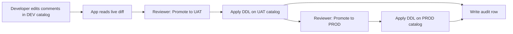

# Comment Promotion — Databricks App (C&W)

Streamlit app that runs inside the Databricks workspace. Reviewers see pending
comment changes side by side, approve with a button, and every promotion is
logged to a Delta audit table.

**No git required for reviewers** — developers still edit comments in the DEV
catalog; reviewers use the web UI.

---

## What this app does



| Tab | Source → target | When to use |
|-----|-----------------|-------------|
| **Promote to UAT** | DEV → UAT | After comments are updated in DEV |
| **Promote to PROD** | UAT → PROD | After UAT bake-in |
| **History** | — | Audit log of past promotions |

---

## Before you start

Fill in your C&W values:

```
Databricks workspace URL:  ___________________________________
SQL warehouse ID:          ___________________________________
DEV catalog:               ___________________________________
UAT catalog:               ___________________________________
PROD catalog:              ___________________________________
Audit table:               ___________________________________   ← e.g. cwc_uat.audit.comment_promotions
Reviewer group:            ___________________________________
Deploying engineer:        ___________________________________
```

You will need:

- [ ] Databricks CLI authenticated to the C&W workspace
- [ ] **Deploy** permission (or equivalent) to create Apps in the workspace
- [ ] Ability to grant UC privileges to the app's service principal
- [ ] A test table that exists in DEV, UAT, and PROD (comment promotion does not create tables)

---

## Part 1 — Databricks prerequisites

### 1.1 Catalogs and warehouse

- [ ] DEV, UAT, and PROD catalogs exist in the same metastore
- [ ] SQL warehouse is running (or serverless and reachable)
- [ ] Warehouse ID copied for configuration below

### 1.2 Audit schema

The app creates the audit table on first run (or you can pre-create it — see
[Audit table](#audit-table)).

- [ ] Audit schema exists, e.g. `cwc_uat.audit`
- [ ] You know the full three-part audit table name

### 1.3 Service principal grants (app runtime identity)

When the app deploys, Databricks creates a **service principal** that runs all
SQL. Grant it:

| Grant | Scope |
|-------|--------|
| `USE CATALOG` | DEV, UAT, PROD catalogs |
| `MODIFY` | Tables in UAT/PROD whose comments will change |
| `CREATE TABLE`, `MODIFY` | Audit schema (for auto-create + inserts) |
| **Can use** | SQL warehouse |

**Verify** (after deploy, using the app SP or a test promote):

```sql
SELECT table_catalog, table_schema, table_name, comment
FROM <uat_catalog>.information_schema.tables
WHERE table_schema = '<schema>' AND table_name = '<test_table>';
```

---

## Part 2 — Local smoke test (recommended)

Run locally before deploying so you catch config and auth issues early.

```bash
cd 02-databricks-app
python3 -m venv .venv && source .venv/bin/activate
pip install -r requirements.txt
pip install -e ../shared

export DATABRICKS_HOST=https://<workspace>.cloud.databricks.com
export DATABRICKS_TOKEN=<pat-or-sp-token>
export DATABRICKS_WAREHOUSE_ID=<warehouse-id>
export DEV_CATALOG=<dev_catalog>
export UAT_CATALOG=<uat_catalog>
export PROD_CATALOG=<prod_catalog>
export AUDIT_TABLE=<catalog>.audit.comment_promotions
export ALLOWED_SCHEMAS=sales,finance   # optional; comma-separated

streamlit run app.py
```

**Pass criteria:**

- [ ] App loads at `http://localhost:8501`
- [ ] Sidebar shows catalog names and warehouse ID
- [ ] **Promote to UAT** tab shows a diff (or "up to date" if catalogs match)
- [ ] No import errors for `comments_core`

> **Shared library:** The app depends on `comments_core` from `../shared`.
> Local dev uses `pip install -e ../shared`. For workspace deployment, ensure
> the deployed app can import `comments_core` (see [Deploy notes](#deploy-notes)).

---

## Part 3 — Configure for C&W

### 3.1 Bundle variables

Edit [`databricks.yml`](databricks.yml) and set C&W-specific values:

```yaml
variables:
  dev_catalog: <dev_catalog>
  uat_catalog: <uat_catalog>
  prod_catalog: <prod_catalog>
  sql_warehouse_id: <warehouse-id>    # required — no default
  audit_table: <catalog>.audit.comment_promotions
```

### 3.2 App environment (`app.yaml`)

[`app.yaml`](app.yaml) maps runtime env vars to Databricks App resources via
`valueFrom`:

| Env var | Resource key | Type |
|---------|--------------|------|
| `DEV_CATALOG` | `dev-catalog` | App environment variable |
| `UAT_CATALOG` | `uat-catalog` | App environment variable |
| `PROD_CATALOG` | `prod-catalog` | App environment variable |
| `DATABRICKS_WAREHOUSE_ID` | `sql-warehouse-id` | SQL warehouse |
| `AUDIT_TABLE` | `audit-table` | App environment variable |

**Option A — configure in workspace UI (recommended for prod):**

After the first deploy, open **Compute → Apps → comment-promotion → Configure**
and add each resource with the key and value from the table above.

**Option B — hardcode for a quick POC:**

Replace `valueFrom` with literal `value` entries in `app.yaml`:

```yaml
  - name: DEV_CATALOG
    value: "cwc_dev"
  - name: DATABRICKS_WAREHOUSE_ID
    value: "<warehouse-id>"
  # ... etc.
```

### 3.3 Authenticate the CLI

```bash
export DATABRICKS_HOST=https://<workspace>.cloud.databricks.com
export DATABRICKS_TOKEN=<token>
# or: databricks auth login --host https://<workspace>.cloud.databricks.com
```

---

## Part 4 — Deploy to the workspace

From `02-databricks-app/`:

```bash
databricks bundle validate
databricks bundle deploy
databricks bundle run comment_promotion_app
```

| Command | What it does |
|---------|----------------|
| `bundle validate` | Checks bundle config |
| `bundle deploy` | Uploads source and registers the app |
| `bundle run comment_promotion_app` | **Starts** the app (required — deploy alone does not keep it running) |

For a production bundle target:

```bash
databricks bundle deploy -t prod
databricks bundle run comment_promotion_app -t prod
```

### Check deploy status

```bash
databricks apps get comment-promotion
databricks apps logs comment-promotion
```

Look for `Deployment successful` and `App started successfully` in the logs.

### Deploy notes

The bundle uploads this folder (`source_code_path: ./`). The app imports
`comments_core` from the repo's `shared/` package. Before go-live, confirm
one of:

- `comments_core` is packaged into the app artifact (e.g. bundle sync + install), or
- `comments-core` is published to an internal package index and listed in
  [`requirements.txt`](requirements.txt)

If the app fails on startup with `ModuleNotFoundError: comments_core`, fix
packaging before continuing.

---

## Part 5 — Permissions and access

### 5.1 Reviewer access

- [ ] Open **Compute → Apps → comment-promotion**
- [ ] Grant **CAN USE** to the reviewer group(s)
- [ ] Grant **CAN MANAGE** only to developers who maintain the app

### 5.2 Service principal (automatic)

- [ ] Confirm UC grants from [Part 1.3](#13-service-principal-grants-app-runtime-identity)
- [ ] Re-check after first failed promote if needed

---

## Part 6 — End-to-end test

Use a **harmless, reversible** comment on one test table.

### 6.1 Change a comment in DEV

In Databricks (Catalog Explorer or SQL), on a table that exists in all three
catalogs:

- [ ] Update a table or column comment to something unique, e.g.
      `E2E test — <name> — <date>`

### 6.2 Promote to UAT

- [ ] Open the app URL from the workspace **Apps** page
- [ ] Sidebar shows your email (from workspace SSO)
- [ ] **Promote to UAT** tab lists the change
- [ ] Type `PROMOTE UAT` and click **Approve & promote to …**
- [ ] Success message appears; no SQL errors

**Verify in UAT:**

```sql
SELECT comment FROM <uat_catalog>.information_schema.tables
WHERE table_schema = '<schema>' AND table_name = '<table>';
```

- [ ] Comment matches DEV

### 6.3 Promote to PROD

- [ ] **Promote to PROD** tab shows UAT → PROD diff (source is UAT, not DEV)
- [ ] Type `PROMOTE PROD` and promote
- [ ] Verify comment in PROD catalog

### 6.4 Audit trail

- [ ] **History** tab shows the promotion with your email and timestamp
- [ ] Query audit table directly:

```sql
SELECT promoted_at, promoted_by, target_catalog, schema_name, table_name, status
FROM <audit_table>
ORDER BY promoted_at DESC
LIMIT 10;
```

---

## Sign-off checklist

| Criterion | OK? |
|-----------|-----|
| App deploys and starts without errors | [ ] |
| Reviewers can open the app (CAN USE) | [ ] |
| DEV → UAT promotion works | [ ] |
| UAT → PROD promotion works | [ ] |
| Audit rows written with reviewer email | [ ] |
| App SP has correct UC + warehouse grants | [ ] |

---

## Audit table

Pre-create (optional — app will attempt auto-create on first run):

```sql
CREATE SCHEMA IF NOT EXISTS <uat_catalog>.audit;

CREATE TABLE IF NOT EXISTS <audit_table> (
  promoted_at      TIMESTAMP,
  promoted_by      STRING,
  source_catalog   STRING,
  target_catalog   STRING,
  kind             STRING,
  schema_name      STRING,
  table_name       STRING,
  column_name      STRING,
  old_value        STRING,
  new_value        STRING,
  sql              STRING,
  status           STRING,
  error            STRING
) USING DELTA;
```

---

## Configuration reference

All runtime config is read from environment variables (set via `app.yaml`):

| Variable | Required | Notes |
|----------|----------|-------|
| `DEV_CATALOG` | yes | Physical DEV catalog name |
| `UAT_CATALOG` | yes | Physical UAT catalog name |
| `PROD_CATALOG` | yes | Physical PROD catalog name |
| `DATABRICKS_WAREHOUSE_ID` | yes | Warehouse for all SQL |
| `AUDIT_TABLE` | yes | Three-part name, e.g. `cwc_uat.audit.comment_promotions` |
| `ALLOWED_SCHEMAS` | no | Comma-separated schema filter for diffs |

Inside the app, SQL runs under the **app service principal**. Reviewer identity
comes from the `X-Forwarded-Email` header (workspace SSO).

---

## Troubleshooting

| Symptom | Likely cause | Fix |
|---------|----------------|-----|
| `ModuleNotFoundError: comments_core` | Shared lib not in app artifact | Package `shared/` — see [Deploy notes](#deploy-notes) |
| App deploys but is not running | `bundle run` not executed | Run `databricks bundle run comment_promotion_app` |
| Empty sidebar / missing catalogs | App resources not configured | Set resources in Apps UI or use literal `value:` in `app.yaml` |
| Could not create audit table | SP missing `CREATE TABLE` on audit schema | Grant on audit schema or pre-create table |
| Permission denied on promote | SP missing `MODIFY` on target table | Grant `MODIFY` on UAT/PROD tables |
| Table skipped silently | Table missing in target catalog | Table must exist in UAT/PROD before promoting |
| PROD tab compares DEV vs PROD | Misunderstanding flow | PROD tab is **UAT → PROD** by design |
| Reviewer shows `anonymous@local` | Running locally without proxy header | Expected locally; in workspace, SSO header is set |

---

## Redeploy after code changes

```bash
cd 02-databricks-app
databricks bundle deploy
databricks bundle run comment_promotion_app
databricks apps logs comment-promotion
```

---

## Related docs

- [Repo root README](../README.md) — shared model, auth, all four approaches
- [`databricks.yml`](databricks.yml) — bundle and app resource definition
- [`app.yaml`](app.yaml) — Streamlit command and env var wiring
- [01-azure-devops E2E checklist](../01-azure-devops/E2E_CHECKLIST.md) — git/PR-based alternative
