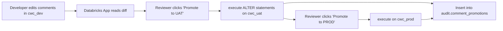

# Approach B — Databricks App with web UI

> A Streamlit-based Databricks App that shows pending comment changes side
> by side, lets a reviewer approve them with a button, and writes an audit
> row for every promotion.

## Why this approach

- **Best UX for non-technical reviewers** — point-and-click, no git.
- **Native SSO** — the app runs inside the workspace, identity is enforced.
- **Audit trail built into the app** — every promotion is written to a Delta
  audit table including the reviewer's email.

## Trade-offs

- Most code to write/maintain of the four approaches.
- Approval is single-stage per env (no "two reviewers required" out of the
  box) — that's solvable but adds complexity.

## Flow



## Run locally

```bash
cd 02-databricks-app
pip install -r requirements.txt
pip install -e ../shared

# Auth to a workspace (use the same warehouse the app will use)
export DATABRICKS_HOST=https://<workspace>.cloud.databricks.com
export DATABRICKS_TOKEN=<pat>
export DATABRICKS_WAREHOUSE_ID=<wh-id>
export DEV_CATALOG=cwc_dev
export UAT_CATALOG=cwc_uat
export PROD_CATALOG=cwc_prod
export AUDIT_TABLE=cwc_uat.audit.comment_promotions

streamlit run app.py
```

## Deploy as a Databricks App

```bash
# From this folder, with the databricks CLI authenticated:
databricks bundle deploy
databricks bundle run comment_promotion_app
```

The bundle in [`databricks.yml`](databricks.yml) declares:

- A Databricks App resource pointing at this folder
- A SQL warehouse dependency (uses the warehouse you configure in the bundle
  variables)

After deploy, open the app URL from the workspace UI. The first time you
run it the app will try to create the audit table at `$AUDIT_TABLE` — the
service principal needs `CREATE TABLE` on that schema.

## Audit table

```sql
CREATE TABLE IF NOT EXISTS <audit-table> (
  promoted_at      TIMESTAMP,
  promoted_by      STRING,
  source_catalog   STRING,
  target_catalog   STRING,
  kind             STRING,
  schema_name      STRING,
  table_name       STRING,
  column_name      STRING,
  old_value        STRING,
  new_value        STRING,
  sql              STRING,
  status           STRING,
  error            STRING
) USING DELTA;
```

## Configuration

All read from env vars at app startup:

| Var | Required | Notes |
|---|---|---|
| `DEV_CATALOG` / `UAT_CATALOG` / `PROD_CATALOG` | yes | physical catalog names |
| `DATABRICKS_WAREHOUSE_ID` | yes | warehouse for SQL execution |
| `AUDIT_TABLE` | yes | three-part name, e.g. `cwc_uat.audit.comment_promotions` |
| `ALLOWED_SCHEMAS` | no | comma-separated list to filter the diff |
