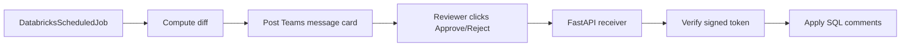

# Approach C — Microsoft Teams approval

This version replaces Slack with **Microsoft Teams**.

A scheduled Databricks Job computes pending comment diffs and posts a Teams
message card with two buttons:

- Approve UAT/PROD
- Reject

The buttons are signed links that hit a FastAPI receiver app and either apply
the promotion or reject it.

## Layout

```
03-teams-approval/
├── detector_job.py
├── teams_cards.py
├── databricks.yml
├── requirements.txt
├── tests/
│   └── test_tokens.py
└── webhook_receiver/
    ├── app.py
    ├── app.yaml
    └── requirements.txt
```

## Flow



## Required env vars

Both job and receiver:

- `DATABRICKS_HOST`
- `DATABRICKS_TOKEN`
- `DATABRICKS_WAREHOUSE_ID`
- `DEV_CATALOG`
- `UAT_CATALOG`
- `PROD_CATALOG`

Detector job:

- `TEAMS_WEBHOOK_URL` (Incoming Webhook URL)
- `APPROVAL_BASE_URL` (Public URL of receiver app, e.g. `https://...`)
- `APPROVAL_SIGNING_SECRET` (shared HMAC secret)

Receiver app:

- `APPROVAL_SIGNING_SECRET`
- `TEAMS_WEBHOOK_URL` (optional, for status posts)
- `TEAMS_STATUS_WEBHOOK_URL` (optional override webhook for result messages)

## Run locally

```bash
cd 03-teams-approval
pip install -r requirements.txt
pip install -e ../shared
python detector_job.py
```

## Deploy via bundle

```bash
cd 03-teams-approval
databricks bundle deploy
```

