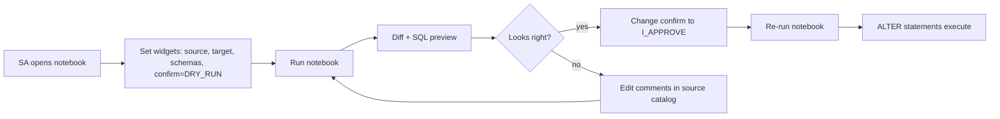

# Approach D — Notebook with widget confirmation

> The minimal version. One Databricks notebook with widgets. The user
> picks a source + target catalog, sees the diff, and has to type
> `I_APPROVE` into a widget before the ALTER statements run.

## Why this approach

- **Zero new infra.** Runs in a Databricks notebook against a SQL warehouse.
- **Fastest path to a working promotion** — useful as a fallback for hotfixes
  even if you adopt one of the other approaches as the primary workflow.

## Trade-offs

- **No multi-person approval.** Whoever runs the notebook is the approver.
- **Weakest audit trail.** Only what's in the notebook's run history.

## How to use

1. Upload [`promote_comments.py`](promote_comments.py) to your workspace as
   a notebook (File → Import Notebook → Source: File).
2. Attach to a Serverless or shared cluster (or run on a SQL warehouse via
   Lakeflow Notebook).
3. Set the widgets:

   | Widget | Value |
   |---|---|
   | `source_catalog` | `cwc_dev` |
   | `target_catalog` | `cwc_uat` |
   | `schema_filter` | `sales,finance` (or leave blank for all) |
   | `confirm` | `DRY_RUN` (safe) or `I_APPROVE` (run) |

4. **First run with `confirm=DRY_RUN`** to review the diff and the exact SQL
   that would execute.
5. **Then run with `confirm=I_APPROVE`** to apply.

## Flow

## When to reach for this

- Hotfix: PROD comment is wrong, can't wait for a PR cycle.
- Bulk initial backfill: importing comments from an external catalog source.
- Local development / testing the shared library against a real warehouse.
