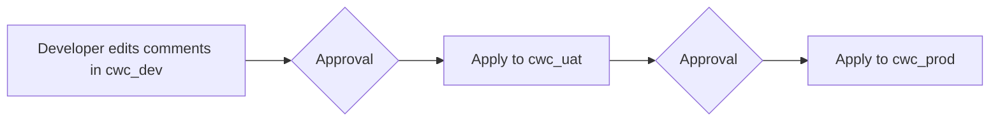

# Comment Promotion POC

Prototype that promotes Unity Catalog **table + column comments** from a DEV
catalog through UAT and into PROD, with an approval gate in the middle.

The interesting question is *what shape should the approval take?* — so this
repo contains **four side-by-side implementations** of the same workflow, each
with a different approval mechanism. They all share a common
`comments_core` library so the only thing that differs is the human step.

## The model

Three catalogs in a single Unity Catalog metastore:

- `cwc_dev` — developers edit comments here freely
- `cwc_uat` — receives the first promotion after approval
- `cwc_prod` — receives the second promotion after approval

A "promotion" is just: compute the diff in table/column comments between the
source and target catalog, render the diff as `COMMENT ON TABLE` /
`ALTER TABLE ... ALTER COLUMN` statements, run them against the target after
an approval step.



## The four approaches

| # | Folder | Approval mechanism | Best when |
|---|---|---|---|
| A | [`01-azure-devops/`](01-azure-devops/) | Azure DevOps PR review of YAML diff + DAB jobs for execution | Data platform team, strong audit needs |
| B | [`02-databricks-app/`](02-databricks-app/) | Web UI inside Databricks with Approve buttons | Mixed reviewers, want point-and-click |
| C | [`03-teams-approval/`](03-teams-approval/) | Teams message card + signed approve/reject links | Async team, reviewers live in Teams |
| D | [`04-notebook-confirm/`](04-notebook-confirm/) | Notebook widget gated on `I_APPROVE` | Minimal infra, single approver, hotfix path |

### Trade-off cheat sheet

- **Setup complexity** — D < A < B < C
- **Reviewer skill required** — B = C (low) < D < A (highest)
- **Audit trail strength** — A (git history) > B (audit table) > C (Teams thread) > D (notebook run history)
- **Multi-person approval** — A & B & C support it natively, D does not
- **Works offline / no extra infra** — D, then A (just git + a job)

## Shared library

[`shared/comments_core/`](shared/) — every POC imports the same primitives:

- `extract_comments(client, warehouse_id, catalog)` — reads
  `information_schema.tables` + `.columns`
- `compute_changes(source, target)` — returns a list of `CommentChange`
- `generate_sql(changes, target_catalog)` — renders the changes as DDL
- `execute(client, warehouse_id, statements)` — runs the DDL on a warehouse

The repo includes focused tests for diff/apply behavior, SQL pagination, and
Teams token verification.

## Quickstart

```bash
# 1. Clone, create venv
python3 -m venv .venv && source .venv/bin/activate

# 2. Install the shared library editable
pip install -e "./shared[dev]"

# 3. Confirm tests pass
cd shared && pytest && cd ..

# 4. Seed three catalogs you can actually promote against
#    (run examples/seed_catalogs.sql in a Databricks SQL editor)

# 5a. Easiest first run:
cd 04-notebook-confirm

# 5b. If you want Azure DevOps PR + DAB execution:
cd 01-azure-devops
databricks bundle validate
databricks bundle run comments_diff_uat
```

## What this POC does *not* do

- Promote tags, owners, constraints, or lineage (comments only).
- Handle multi-metastore federation (single shared metastore is assumed).
- Provide rollback. Forward-only — to "undo", re-extract an older revision
  and re-promote.
- Manage table DDL drift. Tables that exist in DEV but not in PROD are
  skipped silently; that's a DDL-promotion problem, not a comment problem.

## Authentication

Every POC takes the same env vars:

```bash
export DATABRICKS_HOST=https://fevm-serverless-stable-69ija6.cloud.databricks.com
export DATABRICKS_TOKEN=<pat-or-sp-token>
export DATABRICKS_WAREHOUSE_ID=<warehouse-id>
export DEV_CATALOG=cwc_dev
export UAT_CATALOG=cwc_uat
export PROD_CATALOG=cwc_prod
```

For a production deployment, the SP needs `USE CATALOG` on all three catalogs
and `MODIFY` on the UAT/PROD tables you intend to update.
